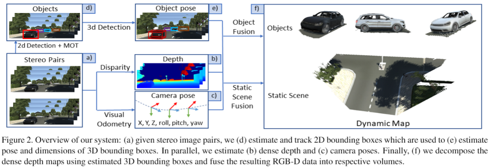

Live Reconstruction of Large-Scale Dynamic Outdoor Worlds
====

# ABOUT

This code implements the state-of-the-art system for dense 3D reconstruction of outdoor environments described in the CVPR 2019 workshop paper [**Live Reconstruction of Large-Scale Dynamic Outdoor Worlds**](https://arxiv.org/pdf/1903.06708.pdf) by Ondrej Miksik and Vibhav Vineet. 

```
@inproceedings{miksik2019cvprw,
  author = {Ondrej Miksik and Vibhav Vineet},
  title = {{L}ive {R}econstruction of {L}arge-{S}cale {D}ynamic {O}utdoor {W}orlds},
  booktitle = {{CVPR} {W}orkshop on {D}ynamic {S}cene {R}econstruction},
  year = {2019}
}
```



### Contacts

For any questions about the code or the paper, feel free to contact us.
More info can be found on the project page: http://www.miksik.co.uk/projects/dfusion/dfusion.html

# HOW TO RUN

### Prerequisites

This project is written in Python 3 and requires `Open3D` and standard packages like `Matplotlib` `Pandas` or `NumPy`.

### Data / How can I process my sequences?

We mostly use `virtual kitti` format, see examples in `data` folder and details in the paper.


### Examples

#### 1. dynamic reconstruction

```
  python main.py --dataset kitti_0003 --d 0 --r --c --f
```

Optional parameters:

- `--start 10` - reconstruction will start from 10th frame 

- `--limit_frames 20` - will reconstruct only 20 frames

- `--no-c` - object instances will not be colour coded

- `--o` - enables on-the-fly output (storing of depth data could be enabled in `main.py`)

- `--out_dir` - sets output directory

More details can be found in `main.py` and by using
```
python main.py --help
```

Surface normals can be visualised by editing `renderoptions.json`

#### 2. standard reconstruction

Remove `--d 0` from command above:
```
  python main.py --dataset kitti_0003 --r --c --f
```

#### 3. debug

Inspect (trajetory-ID colour coded) 2D bboxes
```
python main.py --dataset kitti_0003 --show_2Dbboxes
```

Similarly, we can inspect 3D bboxes using `--show_3Dbboxes` or combine both arguments.


====

Note this is an un-optimised research code which should be cleaned up at some point (pull requests welcomed!)